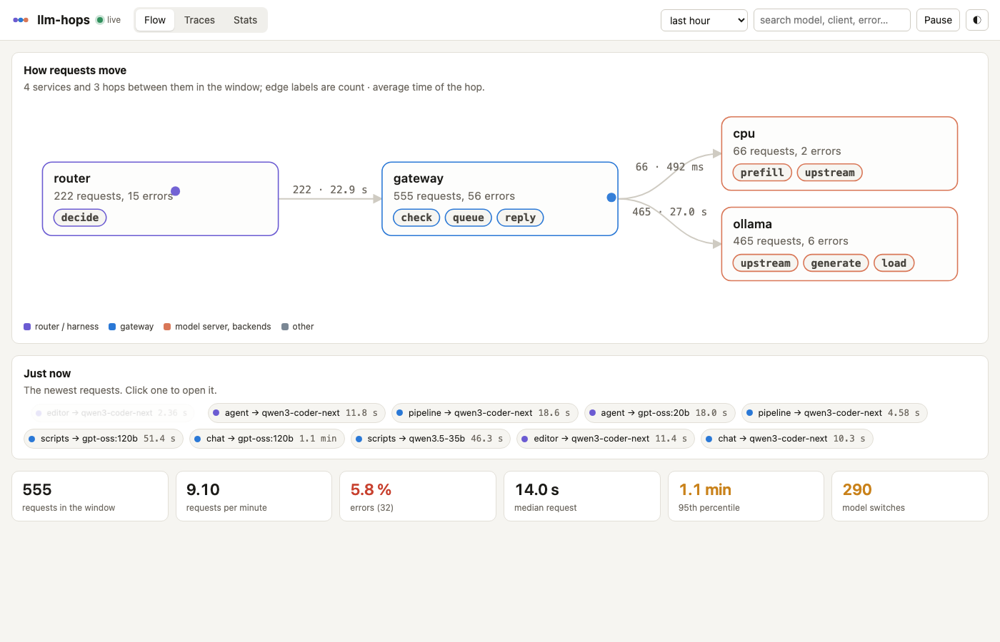
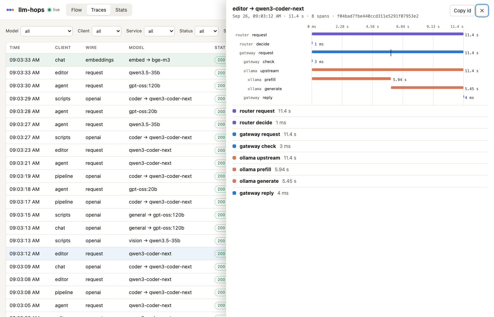

# llm-hops

**See every hop of a request through your local LLM system.**

A request to a local model rarely takes one step. It passes a router that decides whether it may leave the
machine, a gateway that picks the model and checks the prompt, a queue that waits for the one slot, a model
server that may have to load 50 GB first, then prefill, generation and the reply. When an answer takes 40
seconds instead of one, the question is always the same: *where did the time go?*

llm-hops answers it. One static binary keeps the traces in a SQLite file and serves a page with three views:

- **Flow**: the services in your system and the hops between them, with the live requests travelling along
  the edges as they happen, and the newest requests as chips you can open.
- **Traces**: every request in the window, filterable by model, client, service, status and duration, with
  queue time, time to first token, total, tokens and tokens per second. Click one for its **waterfall**: each
  hop as a bar on a time axis, the first-token marker, and every attribute.
- **Stats**: requests per minute, error rate, percentiles per hop ("where the time goes"), per-model rows
  and the number of model switches.

Light and dark. Keyboard: `1` `2` `3` switch views, `/` searches, `j` `k` walk the traces, `Esc` closes,
space pauses the live stream. No build step, no external requests from the page, no prompt text stored.





## Try it in one minute

```bash
go install github.com/YauhenBichel/llm-hops/cmd/llm-hops@latest   # or download a binary from the releases
llm-hops serve -demo 300 -live
```

Open http://127.0.0.1:11602/. The demo is a small home LLM system: a router on a laptop, a gateway with one
slot, a model server that swaps models and loses its cache, five clients.

## Feed it your system

**From a log you already have.** yllm-gateway writes one JSON line per request with queue, upstream,
first-token and total times. Follow it and every line becomes a trace, no code change:

```bash
llm-hops serve -tail ~/yllm-gateway/var/requests.jsonl -from-start
```

Rotation is survived, a partial line waits for its newline, and the same line never makes two traces.
`llm-hops import FILE` loads a file once; `llm-hops tail FILE -to URL` follows it from another machine.

**From your code.** Spans are JSON; post a list to `POST /api/v1/spans`:

```json
{"trace_id": "5f1c…", "span_id": "a1", "parent_id": null, "service": "gateway", "name": "request",
 "start_ms": 1790409578748, "end_ms": 1790409624115, "status": "ok",
 "attrs": {"client": "editor", "model": "qwen3-coder-next", "queue_ms": 1200, "ttft_ms": 5564}}
```

The Python SDK (`pip install llm-hops`, standard library only) opens spans with a context manager, posts
them in batches from a background thread, and has a pure ASGI middleware that makes one span per request
and passes the trace id in the W3C `traceparent` header: [sdk/python](sdk/python/README.md).

A span has a `service`, a `name`, a start and an end in milliseconds, a `status` and flat attributes. The
names the page draws with meaning: `decide`, `check`, `queue`, `load`, `prefill`, `generate`, `upstream`,
`reply`. Any other name is drawn as a plain hop.

## The API

| Call | Gives |
|---|---|
| `POST /api/v1/spans` | a list of spans, or `{"spans": [...]}`; answers accepted, rejected, the trace ids touched |
| `GET /api/v1/traces?since&until&limit&model&client&service&status&min_ms&q` | trace summaries, newest first |
| `GET /api/v1/traces/{id}` | one trace: summary and every span |
| `GET /api/v1/stats?since&until&bucket_ms` | counts, p50/p95/max, per-hop and per-model rows, requests per bucket, model switches |
| `GET /api/v1/flow?since&until` | the services and the aggregated hops between them |
| `GET /api/v1/facets?since&until` | the values the filters can take |
| `GET /api/v1/stream` | server-sent events: one per trace touched |
| `GET /api/v1/health` | ok, time, database path, uptime |

Times are milliseconds since the epoch. Traces older than `-keep-days` (14) are dropped every ten minutes.

## Running it for real

`llm-hops serve` listens on loopback by default. Put it behind your SSH tunnel or a reverse proxy with
authentication before exposing it: the API has no accounts. A systemd unit and the setup used on the
author's server are in [docs/deploy.md](docs/deploy.md). The SQLite file is written with WAL and
`synchronous=FULL`, so a power cut loses no span that was acknowledged.

What is **not** stored: prompts, completions, keys. What the page shows is what the spans carry, so the rule
is on the sender: [docs/privacy.md](docs/privacy.md).

## Building

```bash
go build ./cmd/llm-hops           # Go 1.23+, no CGO, the page is embedded
go test -race ./...
cd sdk/python && uv venv && uv pip install -e ".[dev]" && .venv/bin/python -m pytest
```

## Why this exists

The author runs a home LLM server for coding tools and agents. Its worst days were explained only after the
fact, by reading a request log line by line: a queue that waited for the wrong model, a cache lost by a
program that unloaded the model once a minute, a prompt that was cut silently. The numbers were there; the
picture was not. llm-hops is the picture. The system it was built for is described in
[yserver-local-llm-system](https://github.com/YauhenBichel/yserver-local-llm-system).

## Licence

Apache-2.0. Contributions are welcome; see [CONTRIBUTING.md](CONTRIBUTING.md).
